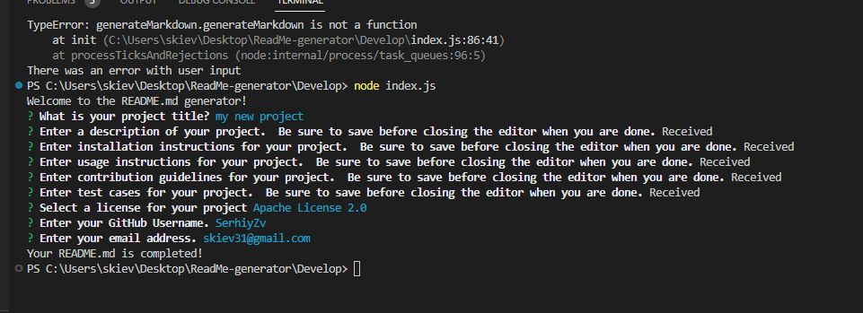

# README generator

  

  ## Description
  Readme generator is command line application to generate professional README file for development projects. Application built using Node.js and the Inquirer package.

  ## Table of Contents

  * [Installation](#installation)
  * [Usage](#usage)
  * [Contributing](#contribution)
  * [Tests](#test)
  * [License](#license)
  * [Contacts](#contacts)
  
  ## Installation
  Clone the repo to your local machine in Git OR download to your machine and extract files from .zip file. Then, install the Inquirer package using npm i command.

  ## Usage
  Run with Node.js – invoke in terminal using node index.js command.

  ## Contribution
  To contribute, fork the repository, add descriptive commits, and then open a pull request back to the original repo describing your proposed changes.
Also users can contact me through email if they wish to provide any feedback or suggestions on how the project can be further improved.

  ## Tests
  The project can be tested by runing the command (node index.js) to test the application, and creating a mock README.md file to ensure the functionality is working properly.

  ## License
  Licensed under MIT license

  https://opensource.org/licenses/MIT

  ## Contacts
  * GitHub: [SerhiyZv](https://github.com/SerhiyZv)
  * Email: [skiev31@gmail.com](mailto:skiev31@gmail.com)

    ## Screenshots

    